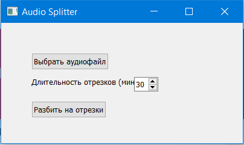

# Программа для разбиения аудиофайлов на отрезки
#### Программа написана на python

Данная программа разработана и написана мною для возможности разбиения больших аудиофайлов(wav формата) с диктофона, для удобства дальнейшей обработки, например транскрибирования(преобразование речи в текст).



##### Для запуска программы из IDE для начала нужно создать виртуальное окружение:
#
```sh
python -m venv venv
```
##### Далее установим все зависимости:
#
```sh
pip install -r -requirements.txt
```
##### Запуск программы осуществляется командой:
#
```sh
python main.py
```
#
##### В корневой папке в output\main имеется файл main.exe, который позволяет запустить программу без установки интерпретатора и всех зависимостей.
#
### Автор:
**uHDezuT**